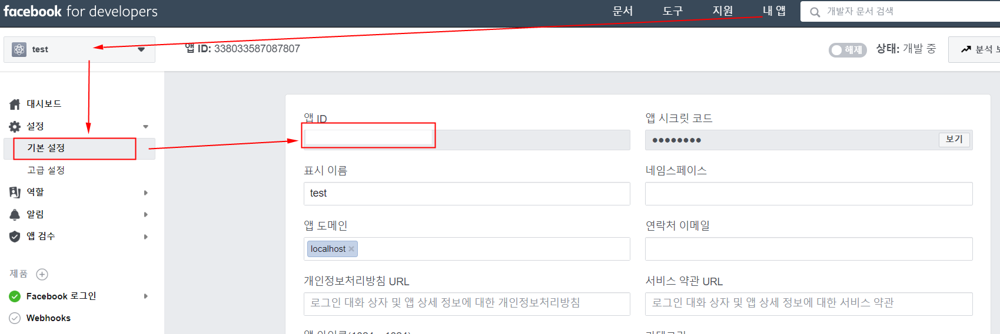
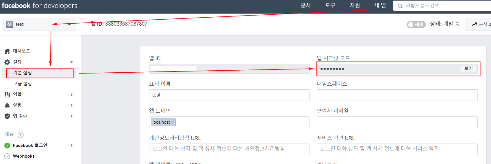
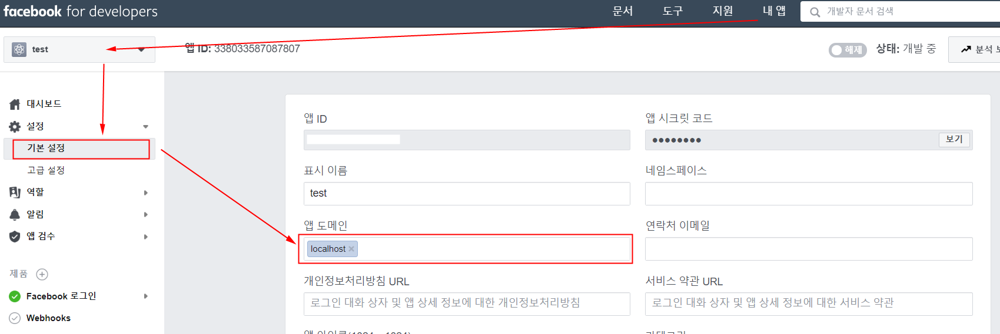
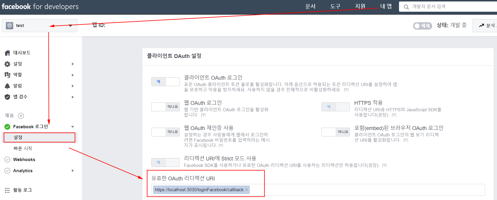

## facebook for developers
각 플랫폼 개발자 센터에서 앱 생성 후 설정을 완료한다. 필요한 ClientID 및 Key 값을 가져온다.  
[facebook for developers](https://developers.facebook.com/apps/)에 로그인 후 앱을 만들고 아래 항목을 확인하고 설정한다.

<br>

## App Setting
 
1. Client ID 확인


2. Client Secret 확인


3. Service URL 설정


4. Callback URL 설정


<br>

## env
앱 설정 시 확인/설정한 값들을 .env에 세팅한다.  

#### client/.env.dev
```
VUE_APP_CLIENT_ID_FACEBOOK=
VUE_APP_CALLBACK_URL_FACEBOOK=http://localhost:3030/loginFacebook/callback
```

#### server/.env
```
CLIENT_ID_FACEBOOK=
CLIENT_SECRET_FACEBOOK=
CALLBACK_URL_FACEBOOK=http://localhost:3030/loginFacebook/callback
```

<br>

## 참고
- [facebook for developers : 로그인 플로 직접 빌드](https://developers.facebook.com/docs/facebook-login/manually-build-a-login-flow?locale=ko_KR)