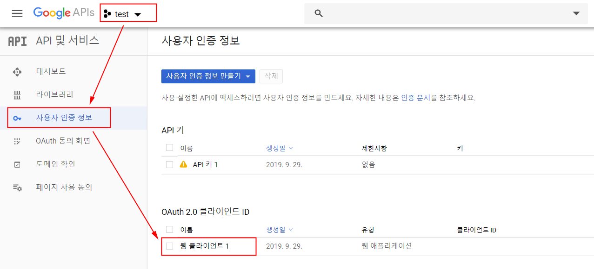
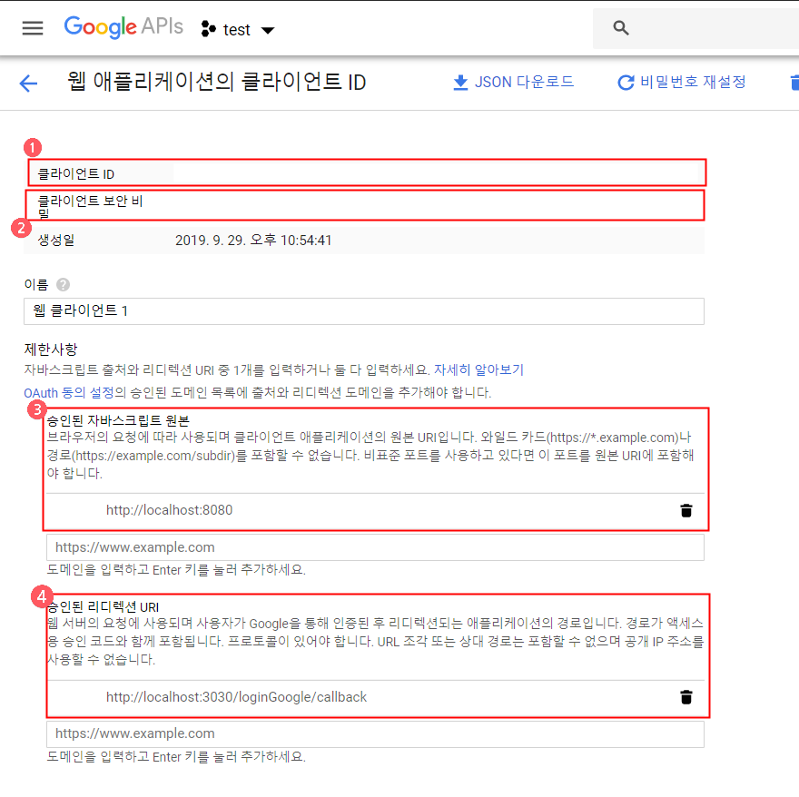

## Google console
각 플랫폼 개발자 센터에서 앱 생성 후 설정을 완료한다. 필요한 ClientID 및 Key 값을 가져온다.  
[Google console](https://console.developers.google.com/apis/credentials)에 로그인 후 앱을 만들고 아래 항목을 확인하고 설정한다.

<br>

## App Setting
 
 
1. Client ID 확인
2. Client Secret 확인
3. Service URL 설정
4. Callback URL 설정

<br>

## env
앱 설정 시 확인/설정한 값들을 .env에 세팅한다.  

#### client/.env.dev
```
VUE_APP_CLIENT_ID_GOOGLE=
VUE_APP_CALLBACK_URL_GOOGLE=http://localhost:3030/loginGoogle/callback
```

#### server/.env
```
CLIENT_ID_GOOGLE=
CLIENT_SECRET_GOOGLE=
CALLBACK_URL_GOOGLE=http://localhost:3030/loginGoogle/callback
```

<br>

## 참고
- [OAuth 2.0 Flow: Server-side web apps](https://developers.google.com/youtube/v3/guides/auth/server-side-web-apps?hl=ko)
