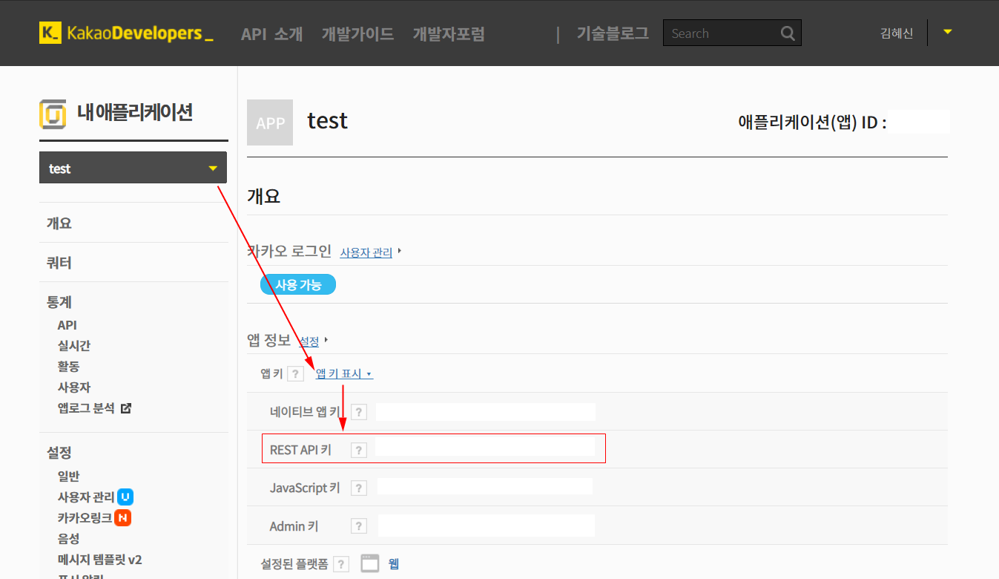
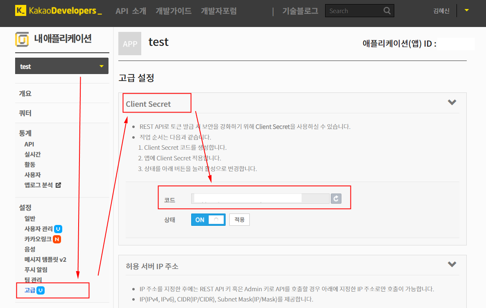
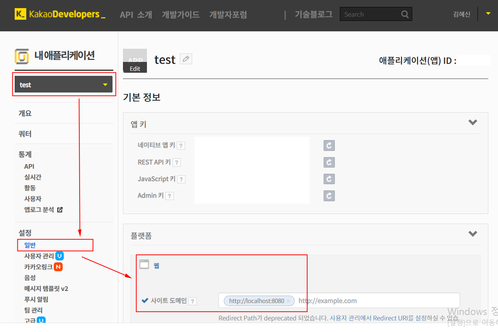
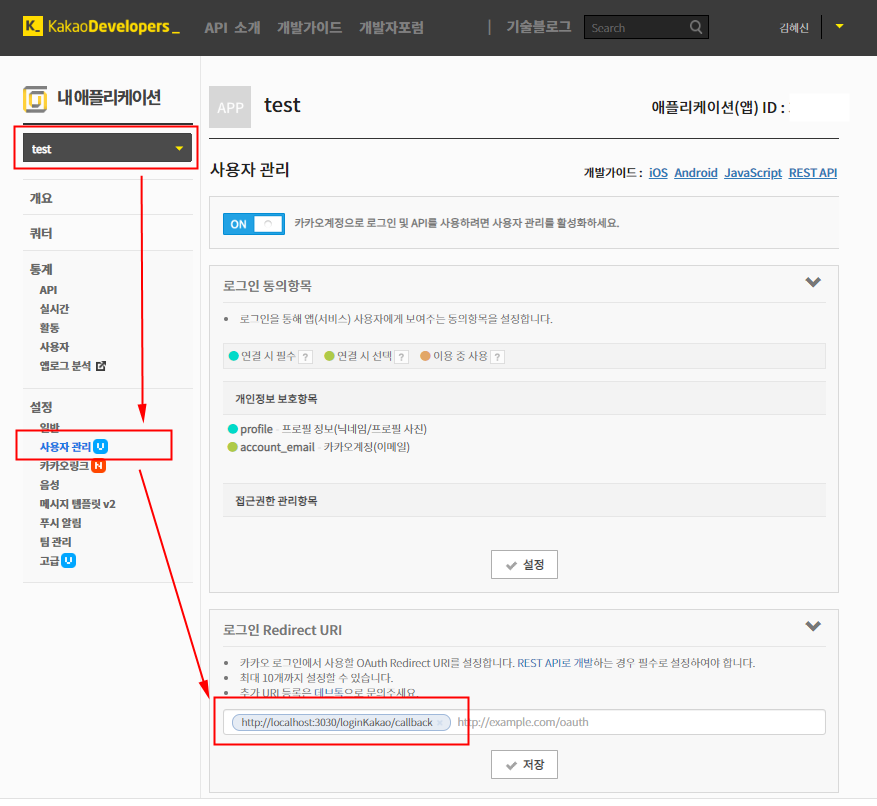

## Kakao Developers
각 플랫폼 개발자 센터에서 앱 생성 후 설정을 완료한다. 필요한 ClientID 및 Key 값을 가져온다.  
[Kakao Developers](https://developers.kakao.com/apps)에 로그인 후 앱을 만들고 아래 항목을 확인하고 설정한다.

<br>

## App Setting
 
1. Client ID 확인


2. Client Secret 확인


3. Service URL 설정


4. Callback URL 설정


<br>

## env
앱 설정 시 확인/설정한 값들을 .env에 세팅한다.  

#### client/.env.dev
```
VUE_APP_CLIENT_ID_KAKAO=
VUE_APP_CALLBACK_URL_KAKAO=http://localhost:3030/loginKakao/callback
```

#### server/.env
```
CLIENT_ID_KAKAO=
CLIENT_SECRET_KAKAO=
CALLBACK_URL_KAKAO=http://localhost:3030/loginKakao/callback
```

<br>

## 참고
- [Kakao REST API 개발가이드 : 로그인](https://developers.kakao.com/docs/restapi/user-management#로그인)
- [Kakao REST API 개발가이드 : 사용자 정보 요청](https://developers.kakao.com/docs/restapi/user-management#사용자-정보-요청)