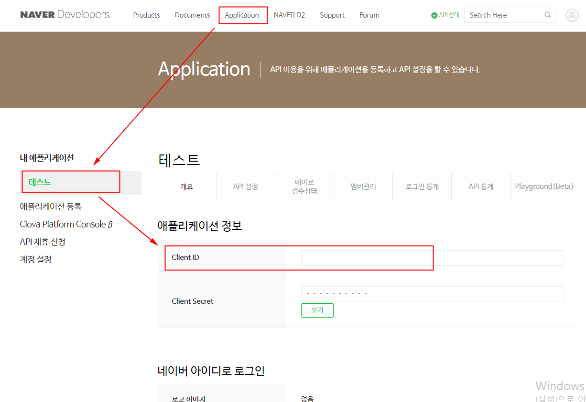
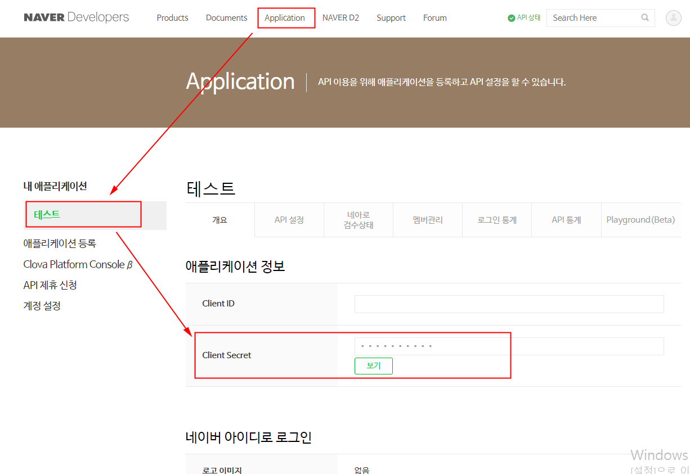
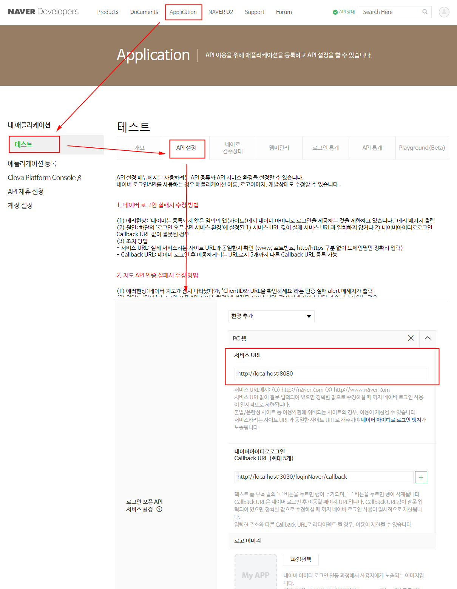
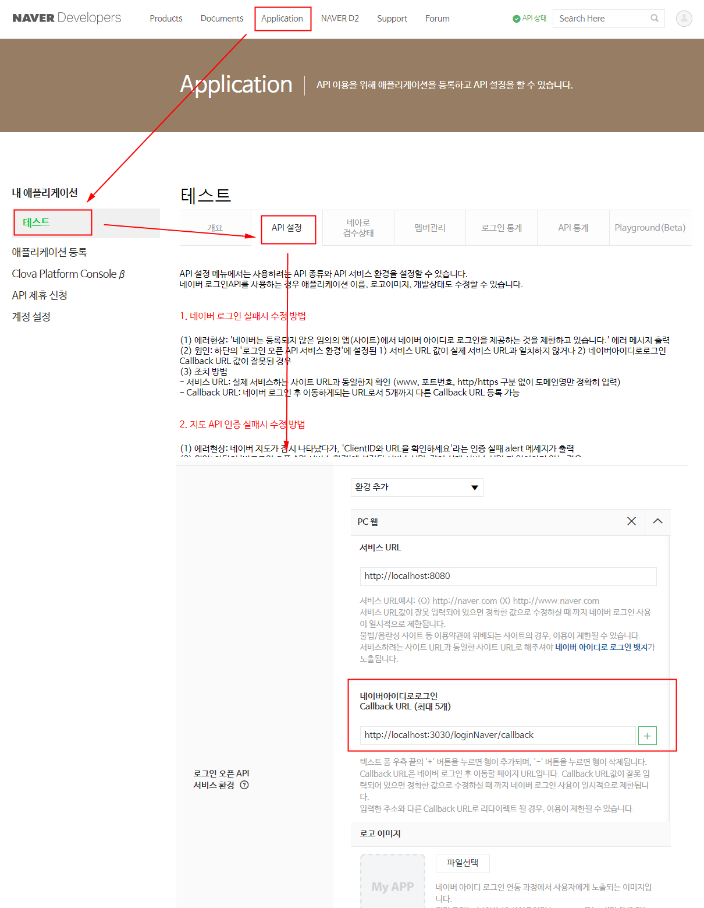

## Naver Developers
각 플랫폼 개발자 센터에서 앱 생성 후 설정을 완료한다. 필요한 ClientID 및 Key 값을 가져온다.  
[NAVER Developers](https://developers.naver.com/apps/#/list)에 로그인 후 앱을 만들고 아래 항목을 확인하고 설정한다.

<br>

## App Setting
 
1. Client ID 확인


2. Client Secret 확인


3. Service URL 설정


4. Callback URL 설정


<br>

## env
앱 설정 시 확인/설정한 값들을 .env에 세팅한다.  

#### client/.env.dev
```
VUE_APP_CLIENT_ID_NAVER=
VUE_APP_CALLBACK_URL_NAVER=http://localhost:3030/loginNaver/callback
```

#### server/.env
```
CLIENT_ID_NAVER=
CLIENT_SECRET_NAVER=
CALLBACK_URL_NAVER=http://localhost:3030/loginNaver/callback
```

<br>

## 참고
- [네이버 아이디로 로그인 API 명세](https://developers.naver.com/docs/login/api/)
- [네이버 회원 프로필 조회 API 명세](https://developers.naver.com/docs/login/profile/)